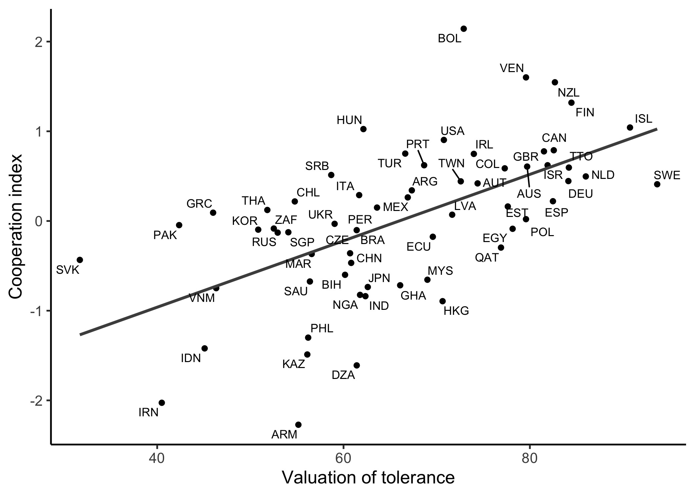
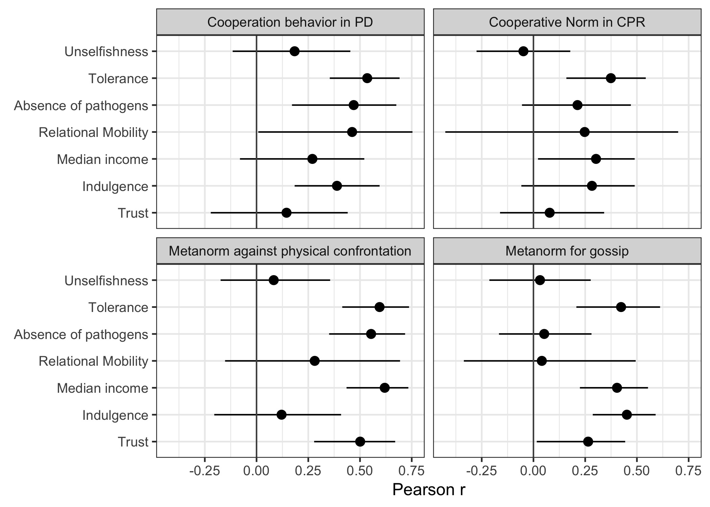

# Results

## Society-Level Analysis

### Table 1

<table class="table" style="width: auto !important; margin-left: auto; margin-right: auto;">
<caption>Table 1. Descriptive Statistics of Key Variables</caption>
 <thead>
  <tr>
   <th style="text-align:left;">   </th>
   <th style="text-align:right;"> N </th>
   <th style="text-align:right;"> Min </th>
   <th style="text-align:right;"> Max </th>
   <th style="text-align:right;"> Mean </th>
   <th style="text-align:right;"> SD </th>
  </tr>
 </thead>
<tbody>
  <tr>
   <td style="text-align:left;"> Valuation of unselfishness </td>
   <td style="text-align:right;"> 62 </td>
   <td style="text-align:right;"> 4.0 </td>
   <td style="text-align:right;"> 54.9 </td>
   <td style="text-align:right;"> 29.0 </td>
   <td style="text-align:right;"> 12.3 </td>
  </tr>
  <tr>
   <td style="text-align:left;"> Valuation of tolerance </td>
   <td style="text-align:right;"> 62 </td>
   <td style="text-align:right;"> 31.7 </td>
   <td style="text-align:right;"> 93.7 </td>
   <td style="text-align:right;"> 66.3 </td>
   <td style="text-align:right;"> 13.4 </td>
  </tr>
  <tr>
   <td style="text-align:left;"> Cooperative behavior in PD </td>
   <td style="text-align:right;"> 40 </td>
   <td style="text-align:right;"> 33.8 </td>
   <td style="text-align:right;"> 49.5 </td>
   <td style="text-align:right;"> 41.6 </td>
   <td style="text-align:right;"> 3.7 </td>
  </tr>
  <tr>
   <td style="text-align:left;"> Cooperative norm in CPR </td>
   <td style="text-align:right;"> 51 </td>
   <td style="text-align:right;"> 3.7 </td>
   <td style="text-align:right;"> 4.4 </td>
   <td style="text-align:right;"> 4.1 </td>
   <td style="text-align:right;"> 0.2 </td>
  </tr>
  <tr>
   <td style="text-align:left;"> Metanorm against physical confrontation </td>
   <td style="text-align:right;"> 51 </td>
   <td style="text-align:right;"> 2.2 </td>
   <td style="text-align:right;"> 4.0 </td>
   <td style="text-align:right;"> 3.2 </td>
   <td style="text-align:right;"> 0.4 </td>
  </tr>
  <tr>
   <td style="text-align:left;"> Metanorm in favor of gossip </td>
   <td style="text-align:right;"> 51 </td>
   <td style="text-align:right;"> 1.8 </td>
   <td style="text-align:right;"> 2.8 </td>
   <td style="text-align:right;"> 2.4 </td>
   <td style="text-align:right;"> 0.2 </td>
  </tr>
  <tr>
   <td style="text-align:left;"> Absence of infectious diseases </td>
   <td style="text-align:right;"> 62 </td>
   <td style="text-align:right;"> -1.2 </td>
   <td style="text-align:right;"> 1.2 </td>
   <td style="text-align:right;"> -0.0 </td>
   <td style="text-align:right;"> 0.6 </td>
  </tr>
  <tr>
   <td style="text-align:left;"> Societal relational mobility </td>
   <td style="text-align:right;"> 31 </td>
   <td style="text-align:right;"> -0.4 </td>
   <td style="text-align:right;"> 0.4 </td>
   <td style="text-align:right;"> 0.0 </td>
   <td style="text-align:right;"> 0.2 </td>
  </tr>
  <tr>
   <td style="text-align:left;"> Median income (thousands of dollars) </td>
   <td style="text-align:right;"> 60 </td>
   <td style="text-align:right;"> 0.0 </td>
   <td style="text-align:right;"> 18.6 </td>
   <td style="text-align:right;"> 5.5 </td>
   <td style="text-align:right;"> 4.9 </td>
  </tr>
  <tr>
   <td style="text-align:left;"> Indulgence </td>
   <td style="text-align:right;"> 59 </td>
   <td style="text-align:right;"> 0.0 </td>
   <td style="text-align:right;"> 100.0 </td>
   <td style="text-align:right;"> 46.7 </td>
   <td style="text-align:right;"> 23.0 </td>
  </tr>
  <tr>
   <td style="text-align:left;"> Trust </td>
   <td style="text-align:right;"> 62 </td>
   <td style="text-align:right;"> 0.0 </td>
   <td style="text-align:right;"> 0.7 </td>
   <td style="text-align:right;"> 0.3 </td>
   <td style="text-align:right;"> 0.2 </td>
  </tr>
</tbody>
</table>
### Table 2

<table>
 <thead>
  <tr>
   <th style="text-align:left;">   </th>
   <th style="text-align:left;"> \(1\) </th>
   <th style="text-align:left;"> \(2\) </th>
   <th style="text-align:left;"> \(3\) </th>
  </tr>
 </thead>
<tbody>
  <tr>
   <td style="text-align:left;"> Cooperative Norm </td>
   <td style="text-align:left;"> 0.34 [0.03, 0.59] </td>
   <td style="text-align:left;">  </td>
   <td style="text-align:left;">  </td>
  </tr>
  <tr>
   <td style="text-align:left;"> Metanorm against physical confrontation </td>
   <td style="text-align:left;"> 0.56 [0.29, 0.74] </td>
   <td style="text-align:left;"> 0.54 [0.33, 0.72] </td>
   <td style="text-align:left;">  </td>
  </tr>
  <tr>
   <td style="text-align:left;"> Metanorm in favor of gossip </td>
   <td style="text-align:left;"> 0.40 [0.04, 0.66] </td>
   <td style="text-align:left;"> 0.38 [0.04, 0.62] </td>
   <td style="text-align:left;"> 0.45 [0.14, 0.69] </td>
  </tr>
</tbody>
</table>
### Index mesures alpha


```
## [1] 0.73
```

```
## [1] 0.72
```
### Table 3

<table>
 <thead>
  <tr>
   <th style="text-align:left;"> Predictor Variable </th>
   <th style="text-align:right;"> N </th>
   <th style="text-align:left;"> Correlation with valuation of unselfishness </th>
   <th style="text-align:left;"> Correlation with valuation of tolerance </th>
  </tr>
 </thead>
<tbody>
  <tr>
   <td style="text-align:left;"> Absence of pathogens </td>
   <td style="text-align:right;"> 62 </td>
   <td style="text-align:left;"> -0.12 [-0.35, 0.14] </td>
   <td style="text-align:left;"> 0.29 [0.03, 0.52] </td>
  </tr>
  <tr>
   <td style="text-align:left;"> Relational Mobility </td>
   <td style="text-align:right;"> 31 </td>
   <td style="text-align:left;"> 0.29 [0.04, 0.52] </td>
   <td style="text-align:left;"> 0.37 [0.13, 0.58] </td>
  </tr>
  <tr>
   <td style="text-align:left;"> Median income </td>
   <td style="text-align:right;"> 60 </td>
   <td style="text-align:left;"> -0.01 [-0.27, 0.26] </td>
   <td style="text-align:left;"> 0.55 [0.32, 0.71] </td>
  </tr>
  <tr>
   <td style="text-align:left;"> Indulgence </td>
   <td style="text-align:right;"> 59 </td>
   <td style="text-align:left;"> 0.24 [-0.01, 0.48] </td>
   <td style="text-align:left;"> 0.44 [0.21, 0.60] </td>
  </tr>
  <tr>
   <td style="text-align:left;"> Trust </td>
   <td style="text-align:right;"> 62 </td>
   <td style="text-align:left;"> 0.10 [-0.13, 0.31] </td>
   <td style="text-align:left;"> 0.43 [0.19, 0.62] </td>
  </tr>
</tbody>
</table>

### Table 4

<table>
 <thead>
  <tr>
   <th style="text-align:left;"> Dependent Variable </th>
   <th style="text-align:right;"> N </th>
   <th style="text-align:left;"> Correlation with valuation of unselfishness </th>
   <th style="text-align:left;"> Correlation with valuation of tolerance </th>
  </tr>
 </thead>
<tbody>
  <tr>
   <td style="text-align:left;"> Cooperation index </td>
   <td style="text-align:right;"> 62 </td>
   <td style="text-align:left;"> 0.11 [-0.12, 0.37] </td>
   <td style="text-align:left;"> 0.59 [0.47, 0.71] </td>
  </tr>
  <tr>
   <td style="text-align:left;"> Cooperation behavior in PD </td>
   <td style="text-align:right;"> 40 </td>
   <td style="text-align:left;"> 0.18 [-0.14, 0.46] </td>
   <td style="text-align:left;"> 0.53 [0.33, 0.69] </td>
  </tr>
  <tr>
   <td style="text-align:left;"> Cooperative Norm in CPR </td>
   <td style="text-align:right;"> 51 </td>
   <td style="text-align:left;"> -0.05 [-0.29, 0.19] </td>
   <td style="text-align:left;"> 0.37 [0.15, 0.54] </td>
  </tr>
  <tr>
   <td style="text-align:left;"> Metanorm against physical confrontation </td>
   <td style="text-align:right;"> 51 </td>
   <td style="text-align:left;"> 0.08 [-0.19, 0.33] </td>
   <td style="text-align:left;"> 0.59 [0.42, 0.74] </td>
  </tr>
  <tr>
   <td style="text-align:left;"> Metanorm for gossip </td>
   <td style="text-align:right;"> 51 </td>
   <td style="text-align:left;"> 0.03 [-0.22, 0.30] </td>
   <td style="text-align:left;"> 0.42 [0.20, 0.60] </td>
  </tr>
</tbody>
</table>

### Correlations between the cooperation index and the other predictors 


```
## # A tibble: 5 x 3
##   measure2                 n     r
## * <fct>                <int> <dbl>
## 1 Absence of pathogens    62  0.33
## 2 Relational Mobility     31  0.48
## 3 Median income           60  0.43
## 4 Indulgence              59  0.41
## 5 Trust                   62  0.28
```


<div class="figure" style="text-align: center">

<p class="caption">Figure 1. Scatter plot of the cooperation index against the valuation of tolerance in 62 societies, abbreviated according to the ISO three-letter standard. The regression line explains 34% of the variance.</p>
</div>

## Individual-Level Analysis

<table class="table" style="width: auto !important; margin-left: auto; margin-right: auto;">
<caption>Table 5. Fixed effects from mixed linear models.</caption>
 <thead>
  <tr>
   <th style="text-align:left;">   </th>
   <th style="text-align:left;"> Cooperative norm </th>
   <th style="text-align:left;"> Metanorm in favor of gossip </th>
   <th style="text-align:left;"> Metanorm against physical confrontation </th>
  </tr>
 </thead>
<tbody>
  <tr>
   <td style="text-align:left;"> Individual valuation of unselfishness </td>
   <td style="text-align:left;"> 0.05 [0.04, 0.07] </td>
   <td style="text-align:left;"> -0.00 [-0.02, 0.01] </td>
   <td style="text-align:left;"> 0.03 [0.01, 0.04] </td>
  </tr>
  <tr>
   <td style="text-align:left;"> Individual valuation of tolerance </td>
   <td style="text-align:left;"> 0.08 [0.07, 0.10] </td>
   <td style="text-align:left;"> 0.01 [-0.01, 0.02] </td>
   <td style="text-align:left;"> 0.06 [0.05, 0.07] </td>
  </tr>
  <tr>
   <td style="text-align:left;"> Societal valuation of unselfishness </td>
   <td style="text-align:left;"> -0.01 [-0.05, 0.03] </td>
   <td style="text-align:left;"> -0.01 [-0.07, 0.05] </td>
   <td style="text-align:left;"> 0.02 [-0.06, 0.10] </td>
  </tr>
  <tr>
   <td style="text-align:left;"> Societal valuation of tolerance </td>
   <td style="text-align:left;"> 0.06 [0.01, 0.10] </td>
   <td style="text-align:left;"> 0.12 [0.07, 0.18] </td>
   <td style="text-align:left;"> 0.10 [0.03, 0.18] </td>
  </tr>
</tbody>
<tfoot>
<tr>
<td style="padding: 0; border:0;" colspan="100%">
<sup></sup> Based on data from n = 17,888 participants who completed metanorm measures in the study of Eriksson et al. (2021).</td>
</tr>
</tfoot>
</table>

# Supplementary Figures

<div class="figure" style="text-align: center">

<p class="caption">Supplementary Figure 1. Pearson correlations between cooperative measures and predictors of cooperation. Error bars signify 95% confidence intervals. Note that samples sizes vary across cooperative measures and predictors.</p>
</div>


